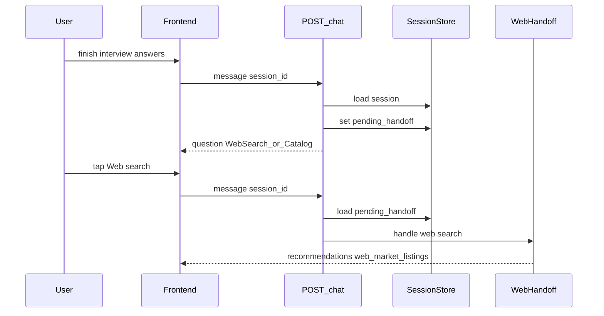

# Frontend Integration Guide: Web Search vs Current Catalog

This document describes the backend API changes for the **commerce source selection** feature and the corresponding frontend work needed to support it.

## Table of contents

- [Overview](#overview)
- [API workflow and session contract](#api-workflow-and-session-contract)
  - [API surface](#api-surface)
  - [End-to-end sequence (laptops, books, phones)](#end-to-end-sequence-laptops-books-phones)
  - [Session persistence](#session-persistence)
  - [Recognized source synonyms](#recognized-source-synonyms)
  - [Response routing matrix](#response-routing-matrix)
  - [Optional direct marketplace APIs](#optional-direct-marketplace-apis)
  - [Latency timings](#latency-timings)
  - [Contract tests](#contract-tests)
- [API Changes](#api-changes)
- [User Flow (Backend Perspective)](#user-flow-backend-perspective)
- [Frontend Changes Required](#frontend-changes-required)
- [Backward Compatibility](#backward-compatibility)
- [Testing the Integration](#testing-the-integration)
- [File Reference](#file-reference)

---

## Overview

After the interview (slot-filling) phase completes for **laptops**, **books**, or **phones**, the backend now returns an intermediate question asking the user to choose between:

- **Web search** — live marketplace listings (eBay today; more sources planned) with deal analysis, FMV comparison, and seller trust scores.
- **Current catalog** — the existing curated product database with specs, ratings, and reviews.

This mirrors the existing category-selection pattern (Cars / Laptops / Books / Phones quick-reply chips).

---

## API workflow and session contract

This section is the **step-by-step HTTP contract** for wiring the frontend: which endpoints to call, what persists between turns, and how server-side state (`pending_handoff`, `commerce_search_mode`) interacts with the JSON body (those fields are **not** returned on `ChatResponse`; the client infers state from `session_id` + last `quick_replies` / `response_type`).

### API surface

| Endpoint | Request body | Response |
|----------|--------------|----------|
| `POST /chat` | `ChatRequest` in [`agent/chat_endpoint.py`](../agent/chat_endpoint.py): `message` (required), `session_id` (optional), `k`, `method`, `n_rows`, `n_per_row`, optional `user_actions` | Full `ChatResponse` JSON including `recommendations` and/or `web_market_listings` |
| `POST /chat-text` | Same body as `/chat` | `ChatTextResponse`: `text`, `session_id`, `response_type` only ([`mcp-server/app/main.py`](../mcp-server/app/main.py) `chat_text`). Listings are flattened into plain text via `_format_response_as_text`. **Rich marketplace cards require `/chat`.** |

OpenClaw and similar adapters often use `/chat-text` or the OpenClaw webhook (same pipeline, formatted text).

### End-to-end sequence (laptops, books, phones)

Applies when the active domain is **laptops**, **books**, or **phones** and the UniversalAgent has gathered enough slots to emit an internal `recommendations_ready`. The public response for the source gate is always a **`question`** with two chips.

**Turn A — interview completes (agent ready to search)**

1. `process_chat` receives `recommendations_ready` from the agent.
2. If `session.commerce_search_mode` is unset, the server **does not** run catalog or eBay yet.
3. It stores **`pending_handoff`** on the session (persisted to Redis when configured) with at least: `domain`, `search_filters`, `question_count`, `original_message`, `n_rows`, `n_per_row`, `compare_first`.
4. Response to the client: `response_type: "question"`, explanatory `message`, `quick_replies: ["Web search", "Current catalog"]`, plus `filters` / `preferences` / `domain` for UI context.

**Turn B — user picks a source (must reuse `session_id`)**

5. On the next `POST /chat`, if `pending_handoff` is present, the user `message` is matched **before** normal UniversalAgent routing.
6. **Web path:** message matches web synonyms (below) → `commerce_search_mode = "web_search"`, `pending_handoff` cleared → [`_handle_web_search_handoff`](../agent/chat_endpoint.py) → [`run_web_search`](../mcp-server/app/commerce_web_search.py) → `_tool_search_and_evaluate_ebay`.
7. **Catalog path:** message matches catalog synonyms → `commerce_search_mode = "catalog"`, handoff cleared → [`_handle_catalog_handoff`](../agent/chat_endpoint.py) → existing `_search_and_respond_ecommerce` (product grid).

**Turn C+ — same session, source already chosen**

8. If the user hits `recommendations_ready` again with `commerce_search_mode == "web_search"`, the server skips the gate and routes straight to `_handle_web_search_handoff` (same web pipeline).



### Session persistence

- **Always echo `session_id`** from the previous `ChatResponse` on the next request. A new session loses `pending_handoff` and `commerce_search_mode`; the user would see the interview or gate again incorrectly.
- **Server fields** (stored on [`InterviewSessionState`](../agent/interview/session_manager.py), serialized with the session):
  - `commerce_search_mode`: `null` / unset until chosen, then `"web_search"` or `"catalog"`.
  - `pending_handoff`: set when the gate question is shown; cleared after a successful web or catalog choice. Shape includes `domain`, `search_filters`, `question_count`, `original_message`, `n_rows`, `n_per_row`, `compare_first`.
- **Reset:** flows that call `reset_session` (e.g. explicit reset keywords, “Different category” behavior that clears the session) **delete** the session record, so commerce source state is cleared for the next `session_id` the client obtains.

### Recognized source synonyms

The next user message is normalized to lowercase and compared to fixed sets in `process_chat` ([`agent/chat_endpoint.py`](../agent/chat_endpoint.py)). Matching is exact on the whole string (after strip), not substring.

**Treated as Web search**

`web search`, `web`, `ebay`, `live listings`, `marketplace`

**Treated as Current catalog**

`current catalog`, `catalog`, `our catalog`, `curated`, `database`

If the user types something else while `pending_handoff` is set, the gate is not consumed by this branch; the message may fall through to other handlers. Prefer sending the exact chip label or one of the synonyms above.

### Response routing matrix

| `response_type` | `web_market_listings` | `recommendations` | Frontend should |
|-----------------|----------------------|-------------------|-----------------|
| `question` | absent / null | absent / null | Render `message` + `quick_replies` (includes source gate) |
| `recommendations` | non-empty array | absent / null | Render **marketplace cards** from `web_market_listings` |
| `recommendations` | `[]` (empty) | absent / null | Show `message` (error / no results) + `quick_replies` (includes “Current catalog”) |
| `recommendations` | absent / null | 2D grid | Render **catalog product grid** (existing) |

### Optional direct marketplace APIs

If a future UI bypasses chat and calls the MCP server directly:

- **`POST /tools/execute`** with `tool_name: "search_and_evaluate_ebay"` and `parameters`: `query`, optional `max_price`, `condition`, `limit`. The server parses natural-language budget and condition **inside `query`** when structured `max_price` / `condition` are omitted (e.g. `query: "Dell laptop under 1000"` → effective max price 1000 and cleaned keywords). See [`mcp-server/app/ebay_query_parser.py`](../mcp-server/app/ebay_query_parser.py) and `search_ebay` in [`mcp-server/app/main.py`](../mcp-server/app/main.py).
- **`GET /search/ebay`** — query parameter `q` is passed through the same parser; optional `max_price` and `condition` query params override parsed values when provided.

### Latency timings

Web handoff responses may include `timings_ms.web_search_ms` on `ChatResponse` for the eBay + evaluation step. Optional for dev or analytics panels.

### Contract tests

Behavioral expectations for the gate, session serialization, text formatter, and NL eBay query parsing are covered by:

- [`mcp-server/tests/test_commerce_source_gate.py`](../mcp-server/tests/test_commerce_source_gate.py)
- [`mcp-server/tests/test_ebay_query_parser.py`](../mcp-server/tests/test_ebay_query_parser.py)

---

## API Changes

### `POST /chat` and `POST /chat-text`

#### New field on `ChatResponse`

```json
{
  "response_type": "recommendations",
  "message": "Found 5 live listings with deal analysis: ...",
  "web_market_listings": [
    {
      "title": "Dell XPS 15 Laptop",
      "price": "$1,199.00",
      "price_cents": 119900,
      "condition": "Used",
      "url": "https://www.ebay.com/itm/123456789",
      "shipping": "Free shipping",
      "item_id": "v1|123456789|0",
      "seller": {
        "seller_username": "tech_deals_usa",
        "feedback_score": 14520,
        "positive_feedback_pct": 99.4,
        "feedback_rating_star": "YellowShooting",
        "top_rated_seller": true
      },
      "merchant_report": {
        "seller_id": "tech_deals_usa",
        "reliability_tier": "HIGH",
        "risk_flags": [],
        "negotiation_context": "Top-rated seller with excellent track record."
      },
      "deal_score": "GOOD",
      "fmv_cents": 110000,
      "fmv_confidence": 0.45,
      "fmv_source": "active_market",
      "recommended_action": "BUY_NOW",
      "action_reasoning": "Price is 8% below fair market value.",
      "target_price_cents": 110000,
      "risk_level": "LOW",
      "suggested_message": null,
      "comparables_used": 12,
      "fmv_stage": "stage_1_exact",
      "fmv_fallback_reason": null,
      "fmv_query_used": "Dell XPS 15 laptop",
      "price_history": {
        "window_days": 90,
        "first_observed": "2026-01-24T12:00:00+00:00",
        "last_observed":  "2026-04-18T20:00:00+00:00",
        "n": 22,
        "p10_cents": 98999,
        "p50_cents": 112499,
        "p90_cents": 129999,
        "min_cents": 89999,
        "max_cents": 139999,
        "trend_pct": -3.4,
        "buckets": [
          {
            "bucket_start": "2026-01-24T00:00:00+00:00",
            "bucket_end":   "2026-01-31T00:00:00+00:00",
            "n": 3,
            "median_cents": 119999,
            "min_cents":    115000,
            "max_cents":    125000
          }
        ],
        "sources": ["ebay_finding", "serpapi"]
      }
    }
  ],
  "quick_replies": ["Current catalog", "More details", "Different category"],
  "session_id": "abc-123",
  "domain": "laptops",
  "filters": { "brand": "Dell", "budget": 150000 },
  "question_count": 3
}
```

**Key points:**

| Field | Type | When present |
|-------|------|--------------|
| `web_market_listings` | `List[object] \| null` | Only when user chose "Web search". `null` or absent for catalog results. |
| `recommendations` | `List[List[object]] \| null` | Only when user chose "Current catalog" (existing behavior). |

Both fields are **mutually exclusive** in practice — a response has one or the other.

---

## Historical pricing (`price_history`)

Every `EvaluatedListing` optionally carries a `price_history` summary built from the same sold comparables the FMV pipeline already fetched. When present, the frontend renders it inline via [`src/components/PriceHistoryChart.tsx`](../idss-web/src/components/PriceHistoryChart.tsx):

- **Card (mini variant)**: inline sparkline + trend pill. Shown below the action badge in `WebMarketListingCard`.
- **Detail view (full variant)**: axis-labelled chart with min/max shaded band and legend. Shown inside the "Deal Analysis" section in `WebMarketListingDetailView`.

The backend returns **the same `price_history` payload for every listing in a result set** (a single comparable pool drives them all), so the chart is comparable across cards within one search.

### Data sources

| `sources[]` value | Source of comparables |
|------|------|
| `ebay_finding` | eBay `findCompletedItems` (primary) |
| `serpapi` | SerpAPI `engine=ebay&show_only=Sold` (augmentation) — only called when eBay sold data is sparse and `SERPAPI_API_KEY` is configured. |
| `ebay_browse` | Active listings fallback (less reliable; only when `n` is small). |

`sources` is a multi-value array — a response may say `["ebay_finding", "serpapi"]` when both contributed.

### When it's absent

`price_history` is `null` (or omitted) when **any** of the following holds:

- Fewer than 3 in-window comparables after filtering, or
- Fewer than 2 non-empty weekly buckets (so the chart would be a single dot), or
- The listing itself couldn't be priced (e.g. `price_cents` missing).

The frontend already guards both `WebMarketListingCard` and `WebMarketListingDetailView` with `listing.price_history && listing.price_history.buckets?.length >= 2`, so no extra work is needed there.

### Feature flag / rollout

SerpAPI augmentation is opt-in via env (see `.env.example` — `SERPAPI_API_KEY` + `FMV_SERPAPI_ENABLED`). When the key is absent the flow degrades gracefully: the chart still renders from eBay-only comps, just with fewer data points.

---

## User Flow (Backend Perspective)

```
┌─────────────────────┐
│  User says "Laptops" │
└─────────┬───────────┘
          ▼
┌─────────────────────┐
│  Interview (2-3 Qs)  │
│  Budget, use case,   │
│  brand preference    │
└─────────┬───────────┘
          ▼
┌─────────────────────────────────┐
│  "Where should we look?"        │
│  quick_replies:                  │
│    ["Web search", "Current catalog"] │
│  response_type: "question"       │
└──────────┬───────────┬──────────┘
           │           │
     "Web search"  "Current catalog"
           │           │
           ▼           ▼
   ┌──────────┐  ┌──────────────┐
   │ eBay +   │  │ Catalog DB   │
   │ MRE +    │  │ (existing)   │
   │ FMV +    │  │              │
   │ Deal     │  │              │
   └────┬─────┘  └──────┬───────┘
        │               │
        ▼               ▼
  web_market_     recommendations
  listings[]       (2D grid)
```

---

## Frontend Changes Required

### 1. Render the source-selection question

The backend returns this as a normal `response_type: "question"` with `quick_replies: ["Web search", "Current catalog"]`. **No special handling needed** if your frontend already renders quick-reply chips generically. The user taps one, and it sends that text as the next message.

### 2. Detect and render `web_market_listings`

When `response.web_market_listings` is a non-empty array, render a **marketplace listing card** instead of the catalog product grid.

**Recommended card layout per listing:**

```
┌─────────────────────────────────────────┐
│  [Title]                    [Deal Badge]│
│  $1,199.00                      GOOD    │
│                                         │
│  Condition: Used                        │
│  Seller: tech_deals_usa (99.4%, HIGH)   │
│                                         │
│  FMV: $1,100.00  (active market)        │
│  Action: BUY_NOW — Price 8% below FMV   │
│                                         │
│  [View on eBay]  [More Details]         │
└─────────────────────────────────────────┘
```

**Fields to display:**

| Field | Display | Notes |
|-------|---------|-------|
| `title` | Card header | Truncate to ~65 chars |
| `price` | Formatted string | Already formatted (e.g. "$1,199.00") |
| `condition` | Badge/label | "New", "Used", "Refurbished" |
| `deal_score` | Color-coded badge | `GOOD` = green, `FAIR` = yellow, `OVERPRICED` = red |
| `seller.seller_username` | Seller line | Show feedback percentage if available |
| `merchant_report.reliability_tier` | Trust badge | `HIGH` = green, `MEDIUM` = yellow, `LOW` = orange, `DO_NOT_BUY` = red |
| `fmv_cents` | FMV price | Convert: `(fmv_cents / 100).toFixed(2)` |
| `fmv_confidence` | Confidence bar/label | 0.0–1.0; consider hiding below 0.1 |
| `fmv_source` | Small label | "sold history" or "active market" |
| `recommended_action` | Action badge | `BUY_NOW`, `NEGOTIATE`, `WAIT`, `SNIPE_BID` |
| `action_reasoning` | Tooltip or subtitle | Short explanation string |
| `target_price_cents` | Counter-offer price | Only meaningful for `NEGOTIATE` |
| `risk_level` | Risk indicator | `LOW`, `MEDIUM`, `HIGH` |
| `url` | "View on eBay" button | External link, open in new tab |
| `suggested_message` | Expandable text | Pre-drafted buyer message (may be null) |

### 3. Deal score color mapping

```javascript
const DEAL_COLORS = {
  GOOD:       { bg: '#dcfce7', text: '#166534', label: 'Good Deal' },
  FAIR:       { bg: '#fef9c3', text: '#854d0e', label: 'Fair Price' },
  OVERPRICED: { bg: '#fecaca', text: '#991b1b', label: 'Overpriced' },
};
```

### 4. Seller trust tier colors

```javascript
const TRUST_COLORS = {
  HIGH:        { bg: '#dcfce7', text: '#166534' },
  MEDIUM:      { bg: '#fef9c3', text: '#854d0e' },
  LOW:         { bg: '#fed7aa', text: '#9a3412' },
  DO_NOT_BUY:  { bg: '#fecaca', text: '#991b1b' },
};
```

### 5. Action badge mapping

```javascript
const ACTION_LABELS = {
  BUY_NOW:    { icon: '✓', label: 'Buy Now',   color: 'green'  },
  NEGOTIATE:  { icon: '💬', label: 'Negotiate', color: 'blue'   },
  WAIT:       { icon: '⏳', label: 'Wait',      color: 'yellow' },
  SNIPE_BID:  { icon: '🎯', label: 'Snipe Bid', color: 'purple' },
};
```

### 6. FMV confidence display

| Confidence | Display |
|------------|---------|
| 0.0 | "No market data" (gray, de-emphasized) |
| 0.01–0.29 | "Low confidence" (yellow) |
| 0.30–0.59 | "Moderate confidence" (blue) |
| 0.60–1.00 | "High confidence" (green) |

When `fmv_source` is `"active_market"`, append a tooltip: *"Based on current active listings, not historical sold prices."*

### 7. Quick replies after web results

The backend sends `quick_replies: ["Current catalog", "More details", "Different category"]` after web results. Render these as action chips so the user can easily switch to catalog or reset.

### 8. Handle empty web results

When `web_market_listings` is `[]` (empty array), the `message` will contain a user-friendly explanation. Display the message and the quick replies which include "Current catalog" as a fallback.

---

## Backward Compatibility

- `web_market_listings` is `null` by default. Existing catalog flows are **unchanged**.
- The `recommendations` field (2D product grid) is still used for catalog results.
- Frontends that do not implement web listing rendering will see the `message` text (which contains a formatted summary) and quick replies — **fully functional without any frontend changes**.

---

## Testing the Integration

### Backend-only (no frontend needed)

```powershell
# 1. Start the server
cd mcp-server
..\.venv\Scripts\Activate.ps1
python -m uvicorn app.main:app --reload --port 8001

# 2. Simulate the full flow via /chat
# Step A: Start session
$r1 = Invoke-RestMethod -Uri "http://127.0.0.1:8001/chat" -Method Post `
  -ContentType "application/json" `
  -Body '{"message": "I want a gaming laptop under $1500"}'
$r1 | ConvertTo-Json -Depth 5

# Step B: Answer questions until you see "Web search" / "Current catalog" chips
$sid = $r1.session_id
$r2 = Invoke-RestMethod -Uri "http://127.0.0.1:8001/chat" -Method Post `
  -ContentType "application/json" `
  -Body "{`"message`": `"no preference`", `"session_id`": `"$sid`"}"
$r2 | ConvertTo-Json -Depth 5

# Step C: Pick "Web search"
$r3 = Invoke-RestMethod -Uri "http://127.0.0.1:8001/chat" -Method Post `
  -ContentType "application/json" `
  -Body "{`"message`": `"Web search`", `"session_id`": `"$sid`"}"
$r3 | ConvertTo-Json -Depth 25
# Check: $r3.web_market_listings should be an array of listing objects
```

### Direct eBay tool test (bypasses interview)

```powershell
$body = @{
  tool_name  = "search_and_evaluate_ebay"
  parameters = @{ query = "gaming laptop RTX 4060"; limit = 3 }
} | ConvertTo-Json -Depth 4

Invoke-RestMethod -Uri "http://127.0.0.1:8001/tools/execute" -Method Post `
  -ContentType "application/json" -Body $body |
  ConvertTo-Json -Depth 25
```

Natural-language budget in `query` only (server parses `max_price`):

```powershell
$body = @{
  tool_name  = "search_and_evaluate_ebay"
  parameters = @{ query = "Dell laptop under 1000"; limit = 5 }
} | ConvertTo-Json -Depth 4

Invoke-RestMethod -Uri "http://127.0.0.1:8001/tools/execute" -Method Post `
  -ContentType "application/json" -Body $body | ConvertTo-Json -Depth 15
```

`GET` smoke test (same NL parsing on `q`):

```powershell
Invoke-RestMethod -Uri "http://127.0.0.1:8001/search/ebay?q=Dell+laptop+under+1000&limit=5"
```

---

## File Reference

| File | Change |
|------|--------|
| `agent/interview/session_manager.py` | Added `commerce_search_mode`, `pending_handoff` to session state |
| `agent/chat_endpoint.py` | Source gate in `process_chat`, handler functions, `ChatResponse.web_market_listings` |
| `agent/prompts.py` | LLM note: don't promise to search eBay |
| `mcp-server/app/commerce_web_search.py` | New module: query builder + eBay search wrapper |
| `mcp-server/app/main.py` | `_format_response_as_text` renders web listings for `/chat-text` |
| `mcp-server/tests/test_commerce_source_gate.py` | Session gate, `pending_handoff`, query builder, `/chat-text` formatter |
| `mcp-server/tests/test_ebay_query_parser.py` | Natural-language budget and condition parsing for eBay `q` / tool `query` |
| `mcp-server/app/ebay_query_parser.py` | `parse_natural_ebay_query` used by `search_ebay` and `search_and_evaluate_ebay` |
